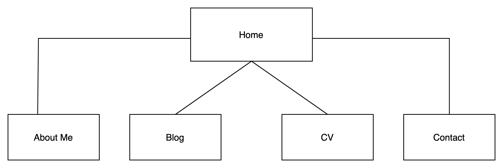
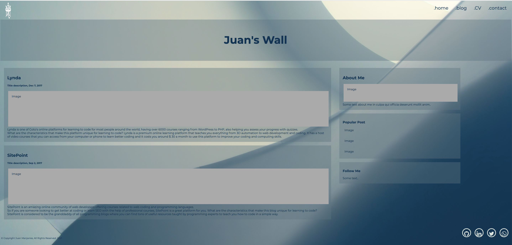
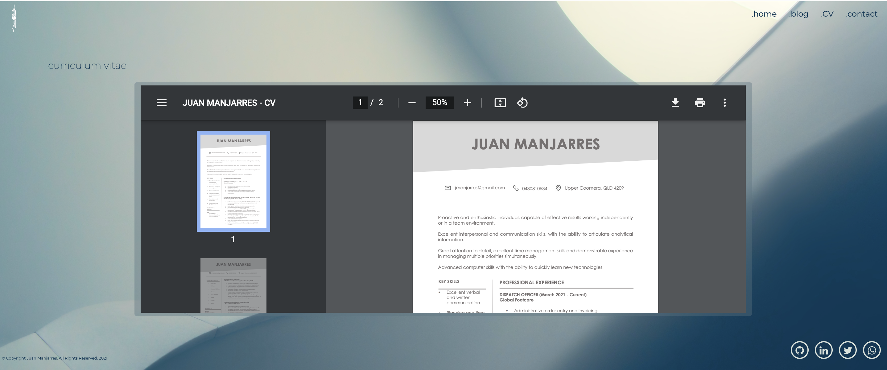

# Coder Academy T1A2 - Portfolio

## URL to published portfolio website

[live site](https://hungry-kowalevski-38d63a.netlify.app/)

## Link to portfolio GitHub repository

[Github](https://github.com/jpmanjarres/JuanManjarres_T1A2)

## Description of portfolio website

### - Purpose and target audience -

The purpose of this portfolio is to provide an online medium in which skills, interests, and professional knowledge may be displayed.
The main target audience are potential employers who wish to view capabilities and gain insight into personality.

### - Sitemap -

### - Functionality and features -

The portfolio consists of 5 html pages supported by 6 css files each (1 Styles and 3 page specific css).

All pages have social media icons which move up and change color on hover. These icons link to their respective social media profiles.
All pages have a hamburger menu at mobile viewport widths. When selected, the hamburger animates into a close 'X' and the nav menu reveals itself sliding in from the top of the page.

All pages share a common theme consisting of a gradient background and a 'drip' graphic to add visual interest for users.

#### index.html

The Home page. 
Contains greeting animate label (typing effect), introduction. it has a profile image that is wrapped in text. and also has a second animation that has a scroll-up effect naming the set of skills I currently have.

#### .blog.html

The blog page contains two columns 
. Each column has divisions, which contains header, picture and text.of a list of my fav blogs (IT related) each one has a picture and a brief description or latest post.

#### resume.html

The resume page contains an embed that reads a pdf and allowed the visitor to either print or download the resume.

#### contact.html

The contact page contains a working contact form responsive that allows to send the information collected to my email. In order to do so, a separate PHP code file has been included.

The form also has validation which disallows a user to submit a form with empty text fields and displays error/helper messages below the input fields.
On successful submission, a thank you message appears at the bottom of the form.

### - Tech stack -

This portfolio website utilises the following technology:

**Languages / stylesheets:**
- HTML
- CSS
- php

**Version control / deployment:**
- GitHub
- Netlify

